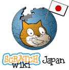

---
# Feel free to add content and custom Front Matter to this file.
# To modify the layout, see https://jekyllrb.com/docs/themes/#overriding-theme-defaults

layout: default
title: TOP
---
  

# T-taku

<a href="https://github.com/T-taku"><i class="fab fa-github"></i></a>

<a href="https://twitter.com/T_taku0427"><i class="fab fa-twitter"></i></a>

<a href="https://t-taku.jp/"><i class="far fa-window-maximize"></i></a>

## Who am I
 

<table>
  <tr>
  <th>名前</th>
    <td>T-taku</td>
  </tr>
  <tr>
  <th>年齢</th>
    <td>14歳</td>
  </tr>
  <tr>
  <th>所属</th>
    <td><a href="https://littlelindo.jp/">project Little Lindo</a></td>
  </tr>
</table>

## Skill
 

<li>
<ul><h3>Programing language</h3> 
Python/CSS/Vue.js/Jekyll/Git
</ul>
<ul><h3>OS</h3> 
Windows/macOS/Ubuntu
</ul>
<ul><h3>Other skill</h3> 
Adobe Illustrator
</ul>
</li>
<h3>GitHub</h3>

## Works
 

外部のお仕事のみ書いています。 

